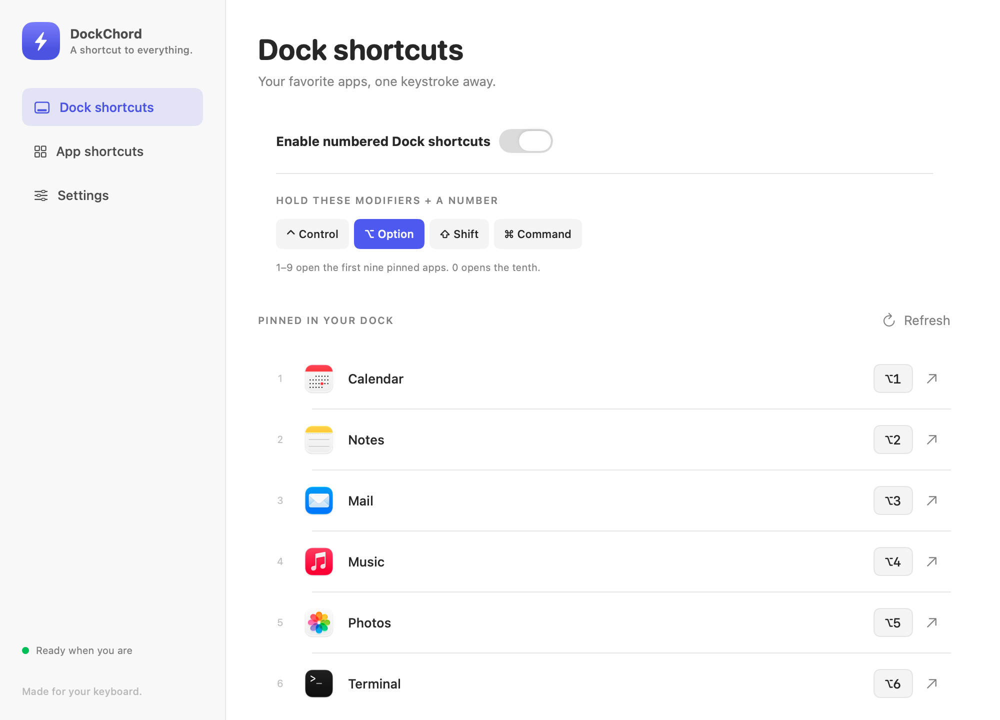
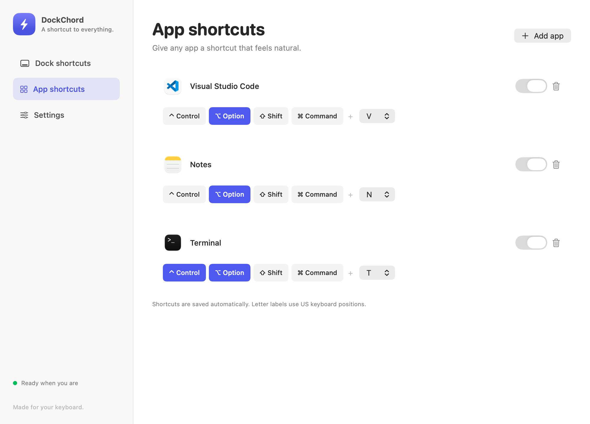
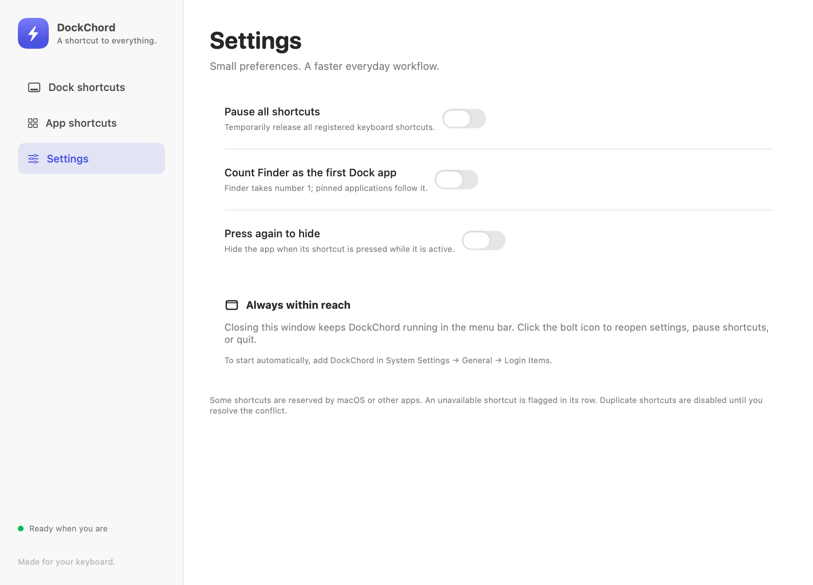

# DockChord

Your Dock. Your apps. One keyboard chord.

DockChord is a native macOS menu-bar app for numbered Dock shortcuts and custom app launch keys. Requires macOS 13 or newer. Native Liquid Glass navigation and controls appear on macOS 26 or newer, with frosted material on older systems. Dark mode and Reduce Transparency are supported. Built with SwiftUI, AppKit, and Carbon global hotkeys; no external dependencies.

## A look inside

These screenshots show the earlier interface with sample applications and shortcuts. Updated Liquid Glass window captures are pending; the current build includes the new glass design.

### Dock shortcuts

Choose your modifier keys and launch pinned apps by number. Shortcuts follow your Dock order automatically.



### App shortcuts

Assign a custom combination to any application, such as Option+V for Visual Studio Code. Enable, disable, or remove each shortcut independently.



### Settings

Pause all shortcuts, include Finder in the numbered list, or press a shortcut again to hide the active app.



## Build and run

Install Xcode 26 or newer, or matching Command Line Tools with the macOS 26 SDK or newer, then run:

```sh
./scripts/build-app.sh
open dist/DockChord.app
```

You can also open `Package.swift` in Xcode. Copy `dist/DockChord.app` into Applications if desired. This build is locally ad-hoc signed, not notarized for distribution.

## Use

- **Dock shortcuts:** Choose any combination of Control, Option, Shift, and Command. Number keys 1–9 and 0 launch the first ten pinned applications, following Dock changes within two seconds. Option is the default. Finder is excluded unless enabled in Settings; recent apps, folders, and separators are excluded.
- **App shortcuts:** Click Add app, select one or more applications, and choose modifiers and a launch key. For example, choose Visual Studio Code, Option, and V. Each shortcut can be disabled or deleted independently.
- **Settings:** Include Finder, pause shortcuts, or enable pressing an active app's shortcut again to hide it. Closing settings leaves the app running in the menu bar.
- To launch at login, add the built application in System Settings → General → Login Items.

Preferences save automatically in the app's UserDefaults. Duplicate combinations disable all conflicting entries; unavailable registrations and missing apps show warnings. At least one modifier is required. System shortcuts and other utilities can reserve combinations. Letter choices currently use physical US keyboard positions (non-US layouts may differ). The app does not require Accessibility permission or record typed text.

## Verify

```sh
./scripts/test.sh
```

The lightweight test runner works with Command Line Tools alone (no XCTest dependency). Tests cover Dock parsing/order/filtering, preference persistence encoding, and shortcut identity. Manually verify global launching by opening another app and pressing Option+1, then adding a custom application shortcut and trying it. Test Dock rearrangement, duplicate warnings, pause/resume, and press-again-to-hide. Dock preference reading relies on macOS's `persistent-apps` preference format.

## Refresh the screenshots

Run `./scripts/screenshots.sh` from a macOS desktop session with Screen Recording permission for the invoking terminal or app. It captures the actual app windows, including composited Liquid Glass, with sample data without changing your saved settings, Dock, or registered shortcuts. Images are saved in `docs/screenshots/`.
